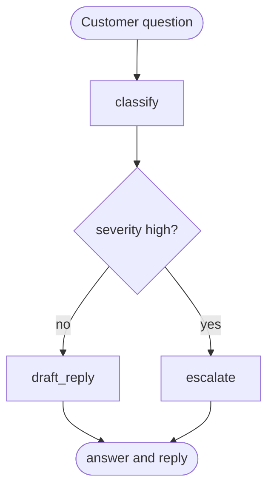

# LangGraph + LangSmith TSE Demo

A small Technical Support Engineer workflow built with [LangGraph](https://docs.langchain.com/oss/python/langgraph) and traced with [LangSmith](https://docs.langchain.com/langsmith).

A customer question enters a graph. The graph classifies it, then either drafts a reply or escalates a high-severity incident. The same path can run offline with a deterministic mock model, which is what CI uses, or against OpenAI with optional LangSmith tracing and evaluation.

The original three evaluation questions are still in the dataset: the capital of France, `5 * 7`, and the author of *1984*. Two support tickets were added so the reply and escalation branches are visible.

## Architecture



| Node | What it does |
| --- | --- |
| `classify` | Labels the question `how_to`, `incident`, `account`, or `general`, and sets severity to `low` or `high`. |
| `draft_reply` | Writes a short factual `answer` and a customer-facing `reply`. |
| `escalate` | Writes an on-call summary and a holding reply that tells the customer the ticket is escalated. |

High severity is reserved for production impact, security issues, and data loss. Everything else stays on the reply path, including the original factual questions.

## Quickstart

Requires Python 3.11+. [uv](https://docs.astral.sh/uv/) is the intended installer. `pip` works too.

```bash
cp .env.example .env
uv sync --extra dev
uv run tse-demo ask "What is the capital of France?"
uv run tse-demo eval
```

With pip:

```bash
python -m venv .venv
source .venv/bin/activate
pip install -e ".[dev]"
tse-demo eval
```

No API key is required. If `OPENAI_API_KEY` is unset, `TSE_LLM_MODE=auto` selects the mock model.

## Example

Input:

```bash
tse-demo ask "Production API is down and returning 503s"
```

Output:

```text
mode: mock
route: escalate
category: incident
severity: high
answer: Escalated to on-call
reply:
I am escalating this to the on-call engineer now. Please send the start time, the affected service, and any request IDs. We will update you as soon as on-call confirms status.
```

A factual question stays on the reply path:

```text
mode: mock
route: reply
category: general
severity: low
answer: Paris
reply:
Thanks for contacting support.

Paris

If that does not solve it, reply with the exact error text and I will dig in further.
```

`tse-demo eval` scores the bundled dataset in-process. A row passes when the expected phrase appears in the answer or reply, ignoring case. That check replaces the old exact-match scorer, which assumed the model returned only the bare fact.

## Configuration

Copy `.env.example` to `.env`. Real keys stay out of git.

| Variable | Default | Purpose |
| --- | --- | --- |
| `TSE_LLM_MODE` | `auto` | `auto`, `mock`, or `openai`. `auto` uses OpenAI only when `OPENAI_API_KEY` is set. |
| `OPENAI_API_KEY` | empty | Required for `openai` mode. |
| `OPENAI_MODEL` | `gpt-4o-mini` | Chat model name passed to `ChatOpenAI`. |
| `LANGSMITH_TRACING` | `false` | Send LangGraph runs to LangSmith when `true`. |
| `LANGSMITH_API_KEY` | empty | Required for tracing and `tse-demo eval --langsmith`. |
| `LANGSMITH_PROJECT` | `tse-langgraph-demo` | LangSmith project name. |
| `LANGSMITH_ENDPOINT` | `https://api.smith.langchain.com` | API endpoint. |
| `LANGSMITH_DATASET` | `tse-qa-eval-demo` | Dataset name used by the remote evaluation. |
| `LANGSMITH_PROMPT_REPLY` | empty | Optional LangSmith prompt identifier. Live runs use it as the draft system prompt. |

## LangSmith

Tracing is off unless you opt in:

```bash
LANGSMITH_TRACING=true
LANGSMITH_API_KEY=...
LANGSMITH_PROJECT=tse-langgraph-demo
TSE_LLM_MODE=openai
```

Each `tse-demo ask` invocation is a LangGraph run named `tse_ticket`, tagged `tse-demo`, with `llm_mode` in the run metadata. LangChain picks up `LANGSMITH_TRACING` on its own. The mock model never calls OpenAI, and it does not pull prompts.

Prompt text lives in `src/tse_demo/prompts.py`. To iterate on the customer-facing prompt in LangSmith, push a prompt in the UI and set `LANGSMITH_PROMPT_REPLY` to its identifier. The openai model path calls `Client.pull_prompt` and uses that template for the draft node. Classify and escalate stay on the local prompts.

Remote evaluation uploads the bundled dataset once, then runs `Client.evaluate`:

```bash
tse-demo eval --langsmith
```

The experiment uses a `contains_expected` evaluator. A second run reuses the dataset instead of inserting duplicate examples.

## Project layout

```text
src/tse_demo/
  cli.py         command line
  graph.py       LangGraph nodes and edges
  models.py      mock model and ChatOpenAI adapter
  prompts.py     TSE prompts and optional hub pull
  evaluate.py    local scoring and LangSmith upload
  data/dataset.json
tests/           graph, scoring, and CLI tests with no network
```

## Development

```bash
make install
make lint
make test
make eval
make ask Q="How do I reset my API key?"
```

GitHub Actions runs Ruff, pytest, and `tse-demo eval` on every push and pull request. The workflow does not need API keys.

The container runs the same offline evaluation:

```bash
docker build -t tse-langgraph-demo .
docker run --rm tse-langgraph-demo
```

## API updates since the 2025 demo

The first version targeted LangChain imports and LangSmith helpers that have since moved.

| Then | Now |
| --- | --- |
| `langchain.chat_models.ChatOpenAI` | `langchain_openai.ChatOpenAI` |
| `langchain.prompts.ChatPromptTemplate` | prompts in `langchain_core`, called through the model adapter |
| `StateGraph()` with no schema | `StateGraph(TicketState)` |
| `client.log_example` | `client.create_examples` |
| `StringEvaluator` exact match | `client.evaluate` with `contains_expected` |
| `LANGCHAIN_TRACING_V2` | `LANGSMITH_TRACING` |

Pinned ranges are in `pyproject.toml`. `uv.lock` records the resolved set.

## Next steps

- Add a retrieval node in front of `draft_reply` so answers come from a product knowledge base.
- Gate the customer reply on a human approval interrupt before it is sent.
- Score tone and completeness with an LLM-as-a-judge evaluator next to `contains_expected`.
